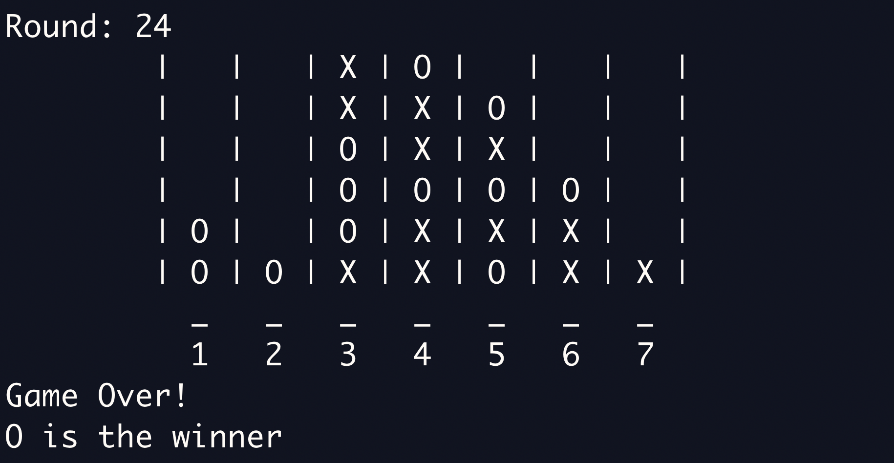

# Reinforcement Learning # 

## Contributors ## 
Calvin Wang -- just me baby 

## Intro ## 
This project was done at CalHacks 5.0 in November 2018. At this hackathon, I wanted to expand my understanding and experience beyond just computer vision and and natural language processing, and into reinforcement learning. I began with FrozenLake and CartPole in OpenAI Gym, and eventually transitioned to adapting Alpha Go Zero to Connect 4. 

## Result ## 

## Concluding Thoughts ## 
At the end of this Hackathon, I feel more comfortable working in reinforcement learning. Moving forward from this project, I have became inspired to see how reinforcement learning can learn just given situations, actions, and rewards. I would like to see how this kind of approach could be applied into different aspects -- from ideas such as hyperparameter tuning to user experience optimization on consumer platforms. 
